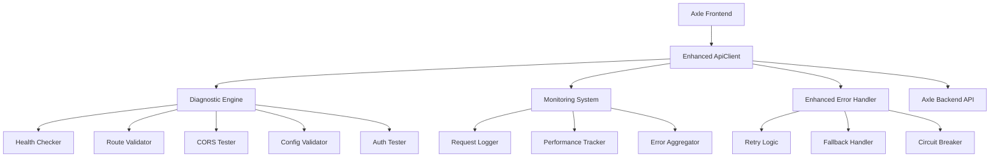

# Design Document: API Connectivity Debugging

## Overview

This design implements a comprehensive diagnostic and monitoring system for the Axle application's API connectivity issues. The solution provides systematic tools to identify, diagnose, and resolve "Not Found" errors between the Next.js frontend and Node.js backend, along with enhanced error handling and monitoring capabilities.

## Architecture

The system consists of three main components:

1. **Diagnostic Engine** - Performs systematic health checks and configuration validation
2. **Monitoring System** - Continuously tracks API performance and captures detailed logs
3. **Enhanced Error Handler** - Implements robust retry logic and fallback mechanisms



## Components and Interfaces

### Diagnostic Engine

The Diagnostic Engine provides systematic testing capabilities for all aspects of API connectivity.

```typescript
interface DiagnosticEngine {
  runFullDiagnostic(): Promise<DiagnosticReport>
  testServerHealth(): Promise<HealthStatus>
  validateRoutes(): Promise<RouteValidationResult>
  testCORS(): Promise<CORSTestResult>
  validateConfiguration(): Promise<ConfigValidationResult>
  testAuthentication(): Promise<AuthTestResult>
  testNetworkConnectivity(): Promise<NetworkTestResult>
}

interface DiagnosticReport {
  timestamp: Date
  overallStatus: 'healthy' | 'degraded' | 'failed'
  results: {
    serverHealth: HealthStatus
    routes: RouteValidationResult
    cors: CORSTestResult
    configuration: ConfigValidationResult
    authentication: AuthTestResult
    network: NetworkTestResult
  }
  recommendations: string[]
}
```

### Health Checker

Validates API server availability and basic functionality.

```typescript
interface HealthChecker {
  checkServerHealth(baseUrl: string): Promise<HealthStatus>
  pingEndpoint(url: string): Promise<PingResult>
  validateHealthEndpoint(): Promise<boolean>
}

interface HealthStatus {
  isHealthy: boolean
  responseTime: number
  statusCode: number
  serverInfo?: {
    version: string
    environment: string
    uptime: number
  }
  error?: string
}
```

### Route Validator

Compares frontend API calls with backend route definitions.

```typescript
interface RouteValidator {
  validateRoutes(frontendRoutes: ApiRoute[], backendRoutes: ApiRoute[]): RouteValidationResult
  extractFrontendRoutes(): Promise<ApiRoute[]>
  fetchBackendRoutes(): Promise<ApiRoute[]>
}

interface RouteValidationResult {
  isValid: boolean
  missingRoutes: ApiRoute[]
  mismatchedMethods: RouteMismatch[]
  parameterIssues: ParameterIssue[]
  versioningIssues: string[]
}

interface ApiRoute {
  path: string
  method: HttpMethod
  parameters: Parameter[]
  version?: string
}
```

### CORS Tester

Diagnoses cross-origin request configuration issues.

```typescript
interface CORSTester {
  testCORS(origin: string, endpoint: string): Promise<CORSTestResult>
  testPreflightRequest(endpoint: string): Promise<PreflightResult>
  validateCORSHeaders(response: Response): CORSValidation
}

interface CORSTestResult {
  isConfigured: boolean
  allowedOrigins: string[]
  allowedMethods: string[]
  allowedHeaders: string[]
  credentialsSupported: boolean
  preflightStatus: PreflightResult
  issues: CORSIssue[]
}
```

### Enhanced Error Handler

Implements robust error handling with retry logic and fallbacks.

```typescript
interface EnhancedErrorHandler {
  handleApiError(error: ApiError, context: RequestContext): Promise<ApiResponse>
  shouldRetry(error: ApiError, attemptCount: number): boolean
  getRetryDelay(attemptCount: number): number
  activateFallback(endpoint: string): Promise<ApiResponse>
  updateCircuitBreakerState(endpoint: string, success: boolean): void
}

interface RetryConfig {
  maxAttempts: number
  baseDelay: number
  maxDelay: number
  backoffMultiplier: number
  retryableStatusCodes: number[]
}
```

### Monitoring System

Tracks API performance and captures detailed diagnostic information.

```typescript
interface MonitoringSystem {
  logRequest(request: ApiRequest, response: ApiResponse): void
  trackPerformance(endpoint: string, responseTime: number): void
  aggregateErrors(timeWindow: TimeWindow): ErrorSummary
  generateHealthReport(): HealthReport
  alertOnPatterns(patterns: AlertPattern[]): void
}

interface RequestLog {
  timestamp: Date
  endpoint: string
  method: string
  statusCode: number
  responseTime: number
  requestSize: number
  responseSize: number
  userAgent?: string
  error?: string
}
```

## Data Models

### Configuration Model

```typescript
interface ApiConfiguration {
  baseUrl: string
  timeout: number
  retryConfig: RetryConfig
  authConfig: AuthConfiguration
  corsConfig: CORSConfiguration
  monitoringConfig: MonitoringConfiguration
}

interface AuthConfiguration {
  tokenEndpoint: string
  refreshEndpoint: string
  tokenStorage: 'localStorage' | 'sessionStorage' | 'memory'
  tokenPrefix: string
}
```

### Error Models

```typescript
interface ApiError extends Error {
  statusCode?: number
  endpoint: string
  method: string
  requestId: string
  timestamp: Date
  retryCount: number
  originalError?: Error
}

interface NetworkError extends ApiError {
  type: 'timeout' | 'connection_refused' | 'dns_failure' | 'ssl_error'
  details: string
}
```

## Correctness Properties

*A property is a characteristic or behavior that should hold true across all valid executions of a system-essentially, a formal statement about what the system should do. Properties serve as the bridge between human-readable specifications and machine-verifiable correctness guarantees.*

### Health Check Properties

**Property 1: Server health validation**
*For any* valid base URL, the health checker should be able to determine server responsiveness and return appropriate status information
**Validates: Requirements 1.1, 1.3**

**Property 2: Error message clarity**
*For any* unreachable server scenario, the system should return clear, informative error messages that help identify the specific connectivity issue
**Validates: Requirements 1.2**

**Property 3: Health monitoring consistency**
*For any* configured monitoring interval, the health monitor should perform checks at the specified frequency and maintain consistent tracking
**Validates: Requirements 1.4**

**Property 4: Failure logging completeness**
*For any* health check failure, the system should log all required diagnostic information including response codes, timing, and connection details
**Validates: Requirements 1.5**

### Route Validation Properties

**Property 5: Route comparison accuracy**
*For any* set of frontend and backend routes, the route validator should correctly identify matches, mismatches, and missing routes
**Validates: Requirements 2.1, 2.2**

**Property 6: HTTP method validation**
*For any* API call configuration, the system should correctly validate that HTTP methods match between frontend calls and backend route definitions
**Validates: Requirements 2.3**

**Property 7: Parameter validation completeness**
*For any* route with parameters, the system should correctly identify missing, extra, or mismatched path parameters
**Validates: Requirements 2.4**

**Property 8: Version matching accuracy**
*For any* API versioning scheme, the system should correctly validate that versions match between frontend and backend URLs
**Validates: Requirements 2.5**

### CORS Testing Properties

**Property 9: CORS validation accuracy**
*For any* origin and endpoint combination, the CORS tester should correctly determine whether the backend allows requests from the specified origin
**Validates: Requirements 3.1**

**Property 10: CORS error reporting completeness**
*For any* CORS misconfiguration, the system should report specific details about which headers, origins, or methods are incorrectly configured
**Validates: Requirements 3.2**

**Property 11: Preflight request validation**
*For any* preflight OPTIONS request, the system should correctly validate that the backend handles it according to CORS specifications
**Validates: Requirements 3.3**

**Property 12: Credential handling validation**
*For any* request requiring credentials, the CORS tester should correctly validate that authentication headers and credentials are properly handled
**Validates: Requirements 3.4**

**Property 13: CORS header completeness**
*For any* API response, the system should correctly validate that all required CORS headers are present and properly configured
**Validates: Requirements 3.5**

### Configuration Validation Properties

**Property 14: URL matching validation**
*For any* frontend and backend URL configuration, the system should correctly identify whether the URLs are properly aligned
**Validates: Requirements 4.1**

**Property 15: Configuration error reporting**
*For any* configuration mismatch, the system should report the specific variables and values that are incorrect
**Validates: Requirements 4.2**

**Property 16: Authentication configuration validation**
*For any* authentication configuration, the system should correctly validate that tokens and API keys are properly formatted and accessible
**Validates: Requirements 4.3**

**Property 17: SSL/TLS validation**
*For any* HTTPS endpoint, the system should correctly validate SSL/TLS configuration and certificate validity
**Validates: Requirements 4.4**

**Property 18: Environment loading validation**
*For any* environment configuration, the system should correctly verify that settings are loaded consistently across frontend and backend
**Validates: Requirements 4.5**

### Authentication Testing Properties

**Property 19: Token validation accuracy**
*For any* authentication token, the system should correctly determine whether it is properly formatted, valid, and not expired
**Validates: Requirements 5.1**

**Property 20: Authentication error classification**
*For any* authentication failure, the system should correctly distinguish between expired, invalid, and missing token scenarios
**Validates: Requirements 5.2**

**Property 21: Header attachment validation**
*For any* authenticated request, the system should correctly validate that authentication headers are properly attached
**Validates: Requirements 5.3**

**Property 22: Token refresh validation**
*For any* token refresh scenario, the system should correctly validate that refresh mechanisms work and produce valid new tokens
**Validates: Requirements 5.4**

**Property 23: Endpoint protection validation**
*For any* protected endpoint, the system should correctly verify that unauthenticated requests are properly rejected
**Validates: Requirements 5.5**

### Error Handling Properties

**Property 24: Exponential backoff implementation**
*For any* API request failure, the error handler should implement exponential backoff retry logic within configured limits
**Validates: Requirements 6.1**

**Property 25: Fallback activation logic**
*For any* sequence of consecutive failures exceeding the threshold, the system should activate appropriate fallback mechanisms
**Validates: Requirements 6.2**

**Property 26: Error context completeness**
*For any* API error, the error handler should provide complete context including request details, response codes, and timing information
**Validates: Requirements 6.3**

**Property 27: Recovery behavior**
*For any* network connectivity restoration, the system should automatically resume normal API operations without manual intervention
**Validates: Requirements 6.4**

**Property 28: Session persistence during outages**
*For any* temporary API outage, the system should maintain user session state and restore it when connectivity returns
**Validates: Requirements 6.5**

### Monitoring Properties

**Property 29: Request logging completeness**
*For any* API request, the monitoring system should log all required information including timestamps, endpoints, response codes, and response times
**Validates: Requirements 7.1**

**Property 30: Failure information capture**
*For any* API failure, the system should capture and store detailed request/response information sufficient for debugging
**Validates: Requirements 7.2**

**Property 31: Performance metrics tracking**
*For any* API activity over time, the monitoring system should correctly track success rates and average response times
**Validates: Requirements 7.3**

**Property 32: Pattern detection and alerting**
*For any* error pattern that meets configured thresholds, the system should generate alerts with actionable diagnostic information
**Validates: Requirements 7.4**

### Network Connectivity Properties

**Property 33: Network reachability testing**
*For any* API server endpoint, the diagnostic tool should perform comprehensive network reachability tests
**Validates: Requirements 8.1**

**Property 34: Latency measurement accuracy**
*For any* network connection, the system should accurately measure and report latency between frontend and backend services
**Validates: Requirements 8.2**

**Property 35: Network error classification**
*For any* network connectivity issue, the system should correctly distinguish between DNS failures, connection timeouts, and HTTP errors
**Validates: Requirements 8.3**

**Property 36: Multi-context connectivity testing**
*For any* available network context, the system should attempt connectivity testing from multiple contexts when possible
**Validates: Requirements 8.4**

**Property 37: Remediation suggestion accuracy**
*For any* identified network issue, the system should provide specific, actionable remediation suggestions appropriate to the problem type
**Validates: Requirements 8.5**

## Error Handling

The system implements comprehensive error handling across all diagnostic and monitoring components:

### Error Classification
- **Network Errors**: DNS failures, connection timeouts, SSL/TLS issues
- **HTTP Errors**: 4xx client errors, 5xx server errors, malformed responses
- **Configuration Errors**: Invalid URLs, missing credentials, CORS misconfigurations
- **Authentication Errors**: Expired tokens, invalid credentials, missing headers

### Error Recovery Strategies
- **Exponential Backoff**: Automatic retry with increasing delays
- **Circuit Breaker**: Temporary suspension of requests to failing endpoints
- **Fallback Responses**: Cached or default responses when primary endpoints fail
- **Graceful Degradation**: Reduced functionality when full API access is unavailable

### Error Reporting
- **Structured Logging**: Consistent error format with correlation IDs
- **Contextual Information**: Request details, timing, and environmental factors
- **Actionable Messages**: Clear descriptions with suggested remediation steps
- **Developer Alerts**: Automated notifications for critical error patterns

## Testing Strategy

The testing approach combines unit tests for specific scenarios with property-based tests for comprehensive validation:

### Unit Testing Focus
- **Specific Error Scenarios**: Test known failure modes and edge cases
- **Configuration Validation**: Test specific configuration combinations
- **Mock Server Responses**: Test diagnostic logic with controlled server responses
- **Integration Points**: Test component interactions and data flow

### Property-Based Testing Focus
- **Diagnostic Accuracy**: Verify diagnostic tools work correctly across all input variations
- **Error Handling Robustness**: Test error handling with randomized failure scenarios
- **Configuration Validation**: Test configuration validation with generated config sets
- **Monitoring Completeness**: Verify monitoring captures all required information

### Testing Configuration
- **Property Tests**: Minimum 100 iterations per test using a property-based testing library
- **Test Tagging**: Each property test tagged with **Feature: api-connectivity-debugging, Property {number}: {property_text}**
- **Mock Infrastructure**: Controlled test environments for network and server simulation
- **Performance Testing**: Validate diagnostic tools don't significantly impact application performance

The testing strategy ensures that the diagnostic and monitoring system is reliable and accurate across all possible API connectivity scenarios.