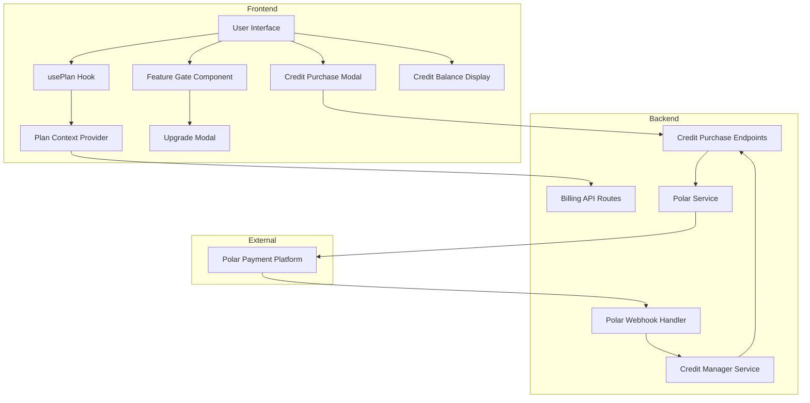

# Design Document: Credit Purchase System and Premium Feature Gating

## Overview

This design document outlines the implementation of a comprehensive credit purchase system integrated with Polar and a premium feature gating system throughout the frontend. The solution consists of three main components:

1. **Backend Credit Purchase System**: API endpoints and webhook handlers for processing one-time credit purchases through Polar
2. **Frontend Plan Recognition System**: Hooks and utilities for detecting user plan tiers and managing feature access
3. **Frontend UI Components**: Modals, badges, and gates for displaying upgrade prompts and purchase flows

The system builds upon the existing Polar subscription integration and credit management infrastructure, extending it to support one-time credit purchases and comprehensive feature gating.

### Key Design Decisions

- **Reuse Existing Infrastructure**: Leverage existing Polar client, webhook validation, and credit management services
- **Atomic Credit Operations**: Use MongoDB's findOneAndUpdate for atomic credit additions to prevent race conditions
- **Idempotent Webhook Processing**: Track processed webhook events to prevent duplicate credit additions
- **Client-Side Plan Caching**: Cache user plan data in React context to minimize API calls
- **Composable Feature Gates**: Create reusable components that can wrap any premium feature
- **Progressive Enhancement**: Ensure core functionality works even if plan detection fails (default to free tier)

## Architecture

### System Components



### Data Flow

#### Credit Purchase Flow


1. User clicks "Purchase Credits" in UI
2. Frontend displays credit package options
3. User selects a package
4. Frontend calls POST /api/v1/billing/credits/checkout with package ID
5. Backend creates Polar checkout session with metadata (userId, packageId, credits)
6. Backend returns checkout URL
7. Frontend redirects user to Polar checkout
8. User completes payment on Polar
9. Polar sends webhook to POST /api/v1/billing/webhook
10. Backend validates webhook signature
11. Backend processes checkout.completed event
12. Backend atomically adds credits to user account
13. Backend logs transaction
14. User returns to app and sees updated credit balance

#### Feature Gate Flow

1. User attempts to access premium feature
2. Feature Gate component checks user plan via usePlan hook
3. If plan tier insufficient, display upgrade modal
4. If plan tier sufficient, render feature content
5. User clicks upgrade in modal
6. Frontend redirects to subscription checkout

## Components and Interfaces

### Backend Components

#### Credit Package Configuration

```typescript
// Credit packages with Polar product IDs
export const CREDIT_PACKAGES = {
  small: {
    credits: 100,
    productId: env.POLAR_CREDITS_100_PRODUCT_ID,
    price: 10, // USD
    label: "Starter Pack"
  },
  medium: {
    credits: 500,
    productId: env.POLAR_CREDITS_500_PRODUCT_ID,
    price: 45, // USD (10% discount)
    label: "Power Pack",
    recommended: true
  },
  large: {
    credits: 1000,
    productId: env.POLAR_CREDITS_1000_PRODUCT_ID,
    price: 80, // USD (20% discount)
    label: "Pro Pack"
  },
  xlarge: {
    credits: 5000,
    productId: env.POLAR_CREDITS_5000_PRODUCT_ID,
    price: 350, // USD (30% discount)
    label: "Enterprise Pack"
  }
}
```

#### Credit Purchase API Endpoints

**POST /api/v1/billing/credits/checkout**


Request:
```typescript
{
  packageId: "small" | "medium" | "large" | "xlarge",
  discountCode?: string
}
```

Response:
```typescript
{
  url: string, // Polar checkout URL
  packageDetails: {
    credits: number,
    price: number,
    label: string
  }
}
```

**GET /api/v1/billing/credits/packages**

Response:
```typescript
{
  packages: Array<{
    id: string,
    credits: number,
    price: number,
    pricePerCredit: number,
    label: string,
    recommended?: boolean
  }>
}
```

**GET /api/v1/billing/credits/history**

Response:
```typescript
{
  transactions: Array<{
    id: string,
    credits: number,
    amount: number,
    status: "completed" | "pending" | "failed",
    createdAt: string,
    polarCheckoutId?: string
  }>
}
```

#### Webhook Event Processing

The existing webhook handler at POST /api/v1/billing/webhook will be extended to handle credit purchase events:

```typescript
// New event type to handle
case "checkout.completed":
  await handleCheckoutCompleted(event.data);
  break;
```

Handler implementation:
```typescript
async function handleCheckoutCompleted(data: any): Promise<void> {
  const { id: checkoutId, customer_id, status, metadata } = data;
  
  // Check if this is a credit purchase (vs subscription)
  if (!metadata?.packageId || !metadata?.credits) {
    logger.info("Checkout completed but not a credit purchase", { checkoutId });
    return;
  }
  
  // Check for duplicate processing
  const existingTransaction = await CreditTransaction.findOne({ 
    polarCheckoutId: checkoutId 
  });
  
  if (existingTransaction) {
    logger.info("Checkout already processed", { checkoutId });
    return;
  }
  
  // Find user
  let user = null;
  if (metadata?.userId) {
    user = await User.findById(metadata.userId);
  }
  if (!user && customer_id) {
    user = await User.findOne({ polarCustomerId: customer_id });
  }
  
  if (!user) {
    logger.error("User not found for credit purchase", { checkoutId, customer_id });
    return;
  }
  
  const credits = parseInt(metadata.credits);
  
  // Atomically add credits
  const result = await CreditManagerService.addCreditsAtomic({
    userId: user._id.toString(),
    amount: credits,
    source: "purchase",
    metadata: { checkoutId, packageId: metadata.packageId }
  });
  
  if (!result.ok) {
    logger.error("Failed to add credits", { userId: user._id, checkoutId });
    return;
  }
  
  // Log transaction
  await CreditTransaction.create({
    userId: user._id,
    credits,
    amount: data.amount || 0,
    status: "completed",
    polarCheckoutId: checkoutId,
    packageId: metadata.packageId
  });
  
  logger.info("Credits added successfully", { 
    userId: user._id, 
    credits, 
    newBalance: result.credits 
  });
}
```

#### Credit Manager Service Extension

Add new method to CreditManagerService:

```typescript
static async addCreditsAtomic(params: {
  userId: string;
  amount: number;
  source: "purchase" | "refund" | "bonus";
  metadata?: any;
}): Promise<{ ok: boolean; credits?: number }> {
  const amount = Math.max(0, Math.ceil(params.amount));
  if (!amount) {
    const credits = await CreditManagerService.getUserCredits(params.userId);
    return { ok: true, credits };
  }

  const updated = await User.findOneAndUpdate(
    { _id: params.userId },
    { $inc: { credits: amount } },
    { new: true }
  ).select("credits");

  if (!updated) return { ok: false };
  
  // Log the credit addition
  logger.info("Credits added", {
    userId: params.userId,
    amount,
    source: params.source,
    newBalance: updated.credits,
    metadata: params.metadata
  });
  
  return { ok: true, credits: updated.credits };
}
```

#### Credit Transaction Model

New model to track credit purchases:

```typescript
import { Schema, model, Document, Types } from "mongoose";

export interface ICreditTransaction extends Document {
  userId: Types.ObjectId;
  credits: number;
  amount: number; // USD cents
  status: "completed" | "pending" | "failed";
  polarCheckoutId?: string;
  packageId: string;
  createdAt: Date;
  updatedAt: Date;
}

const CreditTransactionSchema = new Schema<ICreditTransaction>(
  {
    userId: { type: Schema.Types.ObjectId, ref: "User", required: true },
    credits: { type: Number, required: true },
    amount: { type: Number, required: true },
    status: { 
      type: String, 
      enum: ["completed", "pending", "failed"], 
      required: true 
    },
    polarCheckoutId: { type: String, unique: true, sparse: true },
    packageId: { type: String, required: true }
  },
  { timestamps: true }
);

CreditTransactionSchema.index({ userId: 1, createdAt: -1 });
CreditTransactionSchema.index({ polarCheckoutId: 1 }, { unique: true, sparse: true });

export const CreditTransaction = model<ICreditTransaction>(
  "CreditTransaction", 
  CreditTransactionSchema
);
```

### Frontend Components

#### Plan Context Provider

Provides user plan information throughout the app:

```typescript
// context/PlanContext.tsx
import React, { createContext, useContext, useState, useEffect } from 'react';
import { api } from '@/lib/api';

interface PlanContextType {
  plan: 'free' | 'pro' | 'premium' | 'custom';
  credits: number;
  creditsLimit: number;
  subscriptionStatus: string;
  isLoading: boolean;
  refresh: () => Promise<void>;
  isPro: boolean;
  isPremium: boolean;
  isCustom: boolean;
}

const PlanContext = createContext<PlanContextType | undefined>(undefined);

export const PlanProvider: React.FC<{ children: React.ReactNode }> = ({ children }) => {
  const [planData, setPlanData] = useState({
    plan: 'free' as const,
    credits: 0,
    creditsLimit: 100,
    subscriptionStatus: 'free',
    isLoading: true
  });

  const refresh = async () => {
    try {
      const data = await api.getBillingStatus();
      setPlanData({
        plan: data.plan as any,
        credits: data.credits,
        creditsLimit: data.creditsLimit,
        subscriptionStatus: data.subscriptionStatus,
        isLoading: false
      });
    } catch (error) {
      console.error('Failed to fetch plan data:', error);
      setPlanData(prev => ({ ...prev, isLoading: false }));
    }
  };

  useEffect(() => {
    refresh();
  }, []);

  const value = {
    ...planData,
    refresh,
    isPro: planData.plan === 'pro' || planData.plan === 'premium' || planData.plan === 'custom',
    isPremium: planData.plan === 'premium' || planData.plan === 'custom',
    isCustom: planData.plan === 'custom'
  };

  return <PlanContext.Provider value={value}>{children}</PlanContext.Provider>;
};

export const usePlan = () => {
  const context = useContext(PlanContext);
  if (context === undefined) {
    throw new Error('usePlan must be used within a PlanProvider');
  }
  return context;
};
```

#### Feature Gate Component

Reusable component for gating premium features:

```typescript
// components/FeatureGate.tsx
import React, { useState } from 'react';
import { usePlan } from '@/context/PlanContext';
import { UpgradeModal } from './UpgradeModal';

interface FeatureGateProps {
  requiredPlan: 'pro' | 'premium' | 'custom';
  feature: string;
  children: React.ReactNode;
  fallback?: React.ReactNode;
}

export const FeatureGate: React.FC<FeatureGateProps> = ({
  requiredPlan,
  feature,
  children,
  fallback
}) => {
  const { plan } = usePlan();
  const [showUpgradeModal, setShowUpgradeModal] = useState(false);

  const hasAccess = () => {
    if (requiredPlan === 'pro') {
      return ['pro', 'premium', 'custom'].includes(plan);
    }
    if (requiredPlan === 'premium') {
      return ['premium', 'custom'].includes(plan);
    }
    if (requiredPlan === 'custom') {
      return plan === 'custom';
    }
    return false;
  };

  if (hasAccess()) {
    return <>{children}</>;
  }

  if (fallback) {
    return <>{fallback}</>;
  }

  return (
    <>
      <div 
        className="relative cursor-pointer"
        onClick={() => setShowUpgradeModal(true)}
      >
        <div className="blur-sm pointer-events-none opacity-50">
          {children}
        </div>
        <div className="absolute inset-0 flex items-center justify-center">
          <button className="px-6 py-3 bg-gradient-to-r from-purple-600 to-blue-600 text-white rounded-lg font-semibold hover:shadow-lg transition-all">
            Upgrade to {requiredPlan.charAt(0).toUpperCase() + requiredPlan.slice(1)} to unlock
          </button>
        </div>
      </div>
      
      {showUpgradeModal && (
        <UpgradeModal
          isOpen={showUpgradeModal}
          onClose={() => setShowUpgradeModal(false)}
          feature={feature}
          requiredPlan={requiredPlan}
        />
      )}
    </>
  );
};
```

#### Upgrade Modal Component


```typescript
// components/UpgradeModal.tsx
import React from 'react';
import { usePlan } from '@/context/PlanContext';
import { api } from '@/lib/api';

interface UpgradeModalProps {
  isOpen: boolean;
  onClose: () => void;
  feature: string;
  requiredPlan: 'pro' | 'premium' | 'custom';
}

export const UpgradeModal: React.FC<UpgradeModalProps> = ({
  isOpen,
  onClose,
  feature,
  requiredPlan
}) => {
  const { plan } = usePlan();
  const [loading, setLoading] = useState(false);

  const handleUpgrade = async (selectedPlan: string) => {
    setLoading(true);
    try {
      const { url } = await api.createCheckout(selectedPlan);
      window.location.href = url;
    } catch (error) {
      console.error('Failed to create checkout:', error);
      alert('Failed to start checkout. Please try again.');
      setLoading(false);
    }
  };

  if (!isOpen) return null;

  const plans = [
    {
      id: 'pro',
      name: 'Pro',
      price: '$29/mo',
      features: [
        '10 agents',
        '1,000 credits/month',
        'Webhook triggers',
        '3 schedules per agent',
        'Priority support'
      ]
    },
    {
      id: 'premium',
      name: 'Premium',
      price: '$99/mo',
      features: [
        '50 agents',
        '5,000 credits/month',
        'Webhook triggers',
        'Unlimited schedules',
        'Advanced analytics',
        'Priority support'
      ],
      recommended: true
    }
  ];

  return (
    <div className="fixed inset-0 z-50 flex items-center justify-center bg-black/50">
      <div className="bg-white dark:bg-gray-900 rounded-xl shadow-2xl max-w-4xl w-full mx-4 max-h-[90vh] overflow-y-auto">
        <div className="p-6 border-b border-gray-200 dark:border-gray-700">
          <div className="flex justify-between items-center">
            <div>
              <h2 className="text-2xl font-bold">Upgrade Required</h2>
              <p className="text-gray-600 dark:text-gray-400 mt-1">
                {feature} requires a {requiredPlan} plan or higher
              </p>
            </div>
            <button
              onClick={onClose}
              className="text-gray-500 hover:text-gray-700 dark:hover:text-gray-300"
            >
              ✕
            </button>
          </div>
        </div>

        <div className="p-6">
          <div className="grid md:grid-cols-2 gap-6">
            {plans.map((planOption) => (
              <div
                key={planOption.id}
                className={`border rounded-lg p-6 ${
                  planOption.recommended
                    ? 'border-purple-500 ring-2 ring-purple-500'
                    : 'border-gray-200 dark:border-gray-700'
                }`}
              >
                {planOption.recommended && (
                  <div className="text-purple-600 font-semibold text-sm mb-2">
                    RECOMMENDED
                  </div>
                )}
                <h3 className="text-xl font-bold">{planOption.name}</h3>
                <div className="text-3xl font-bold mt-2">{planOption.price}</div>
                <ul className="mt-4 space-y-2">
                  {planOption.features.map((feature, idx) => (
                    <li key={idx} className="flex items-center text-sm">
                      <span className="text-green-500 mr-2">✓</span>
                      {feature}
                    </li>
                  ))}
                </ul>
                <button
                  onClick={() => handleUpgrade(planOption.id)}
                  disabled={loading}
                  className={`w-full mt-6 py-3 rounded-lg font-semibold transition-all ${
                    planOption.recommended
                      ? 'bg-gradient-to-r from-purple-600 to-blue-600 text-white hover:shadow-lg'
                      : 'bg-gray-200 dark:bg-gray-700 hover:bg-gray-300 dark:hover:bg-gray-600'
                  }`}
                >
                  {loading ? 'Loading...' : `Upgrade to ${planOption.name}`}
                </button>
              </div>
            ))}
          </div>
        </div>
      </div>
    </div>
  );
};
```

#### Credit Balance Display Component

```typescript
// components/CreditBalanceDisplay.tsx
import React, { useState } from 'react';
import { usePlan } from '@/context/PlanContext';
import { CreditPurchaseModal } from './CreditPurchaseModal';

export const CreditBalanceDisplay: React.FC = () => {
  const { credits, creditsLimit, refresh } = usePlan();
  const [showPurchaseModal, setShowPurchaseModal] = useState(false);

  const percentage = (credits / creditsLimit) * 100;
  const isLow = percentage < 20;
  const isCritical = credits === 0;

  return (
    <>
      <button
        onClick={() => setShowPurchaseModal(true)}
        className={`flex items-center gap-2 px-4 py-2 rounded-lg transition-all ${
          isCritical
            ? 'bg-red-100 dark:bg-red-900/30 text-red-700 dark:text-red-400 animate-pulse'
            : isLow
            ? 'bg-yellow-100 dark:bg-yellow-900/30 text-yellow-700 dark:text-yellow-400'
            : 'bg-gray-100 dark:bg-gray-800 hover:bg-gray-200 dark:hover:bg-gray-700'
        }`}
      >
        <span className="text-sm font-medium">Credits:</span>
        <span className="font-bold">{credits.toLocaleString()}</span>
        {isLow && <span className="text-xs">⚠️</span>}
      </button>

      {showPurchaseModal && (
        <CreditPurchaseModal
          isOpen={showPurchaseModal}
          onClose={() => {
            setShowPurchaseModal(false);
            refresh();
          }}
        />
      )}
    </>
  );
};
```

#### Credit Purchase Modal Component

```typescript
// components/CreditPurchaseModal.tsx
import React, { useState, useEffect } from 'react';
import { api } from '@/lib/api';

interface CreditPurchaseModalProps {
  isOpen: boolean;
  onClose: () => void;
}

interface CreditPackage {
  id: string;
  credits: number;
  price: number;
  pricePerCredit: number;
  label: string;
  recommended?: boolean;
}

export const CreditPurchaseModal: React.FC<CreditPurchaseModalProps> = ({
  isOpen,
  onClose
}) => {
  const [packages, setPackages] = useState<CreditPackage[]>([]);
  const [loading, setLoading] = useState(false);
  const [purchasing, setPurchasing] = useState(false);

  useEffect(() => {
    if (isOpen) {
      loadPackages();
    }
  }, [isOpen]);

  const loadPackages = async () => {
    setLoading(true);
    try {
      const data = await api.get<{ packages: CreditPackage[] }>(
        '/billing/credits/packages'
      );
      setPackages(data.packages);
    } catch (error) {
      console.error('Failed to load credit packages:', error);
    } finally {
      setLoading(false);
    }
  };

  const handlePurchase = async (packageId: string) => {
    setPurchasing(true);
    try {
      const data = await api.post<{ url: string }>(
        '/billing/credits/checkout',
        { packageId }
      );
      window.location.href = data.url;
    } catch (error) {
      console.error('Failed to create checkout:', error);
      alert('Failed to start checkout. Please try again.');
      setPurchasing(false);
    }
  };

  if (!isOpen) return null;

  return (
    <div className="fixed inset-0 z-50 flex items-center justify-center bg-black/50">
      <div className="bg-white dark:bg-gray-900 rounded-xl shadow-2xl max-w-4xl w-full mx-4 max-h-[90vh] overflow-y-auto">
        <div className="p-6 border-b border-gray-200 dark:border-gray-700">
          <div className="flex justify-between items-center">
            <div>
              <h2 className="text-2xl font-bold">Purchase Credits</h2>
              <p className="text-gray-600 dark:text-gray-400 mt-1">
                Choose a credit package to continue using Axle
              </p>
            </div>
            <button
              onClick={onClose}
              className="text-gray-500 hover:text-gray-700 dark:hover:text-gray-300"
            >
              ✕
            </button>
          </div>
        </div>

        <div className="p-6">
          {loading ? (
            <div className="text-center py-12">Loading packages...</div>
          ) : (
            <div className="grid md:grid-cols-2 lg:grid-cols-4 gap-4">
              {packages.map((pkg) => (
                <div
                  key={pkg.id}
                  className={`border rounded-lg p-6 ${
                    pkg.recommended
                      ? 'border-purple-500 ring-2 ring-purple-500'
                      : 'border-gray-200 dark:border-gray-700'
                  }`}
                >
                  {pkg.recommended && (
                    <div className="text-purple-600 font-semibold text-xs mb-2">
                      BEST VALUE
                    </div>
                  )}
                  <h3 className="text-lg font-bold">{pkg.label}</h3>
                  <div className="text-3xl font-bold mt-2">
                    {pkg.credits.toLocaleString()}
                  </div>
                  <div className="text-sm text-gray-600 dark:text-gray-400">
                    credits
                  </div>
                  <div className="text-2xl font-bold mt-4">
                    ${pkg.price}
                  </div>
                  <div className="text-xs text-gray-600 dark:text-gray-400">
                    ${pkg.pricePerCredit.toFixed(3)} per credit
                  </div>
                  <button
                    onClick={() => handlePurchase(pkg.id)}
                    disabled={purchasing}
                    className={`w-full mt-6 py-3 rounded-lg font-semibold transition-all ${
                      pkg.recommended
                        ? 'bg-gradient-to-r from-purple-600 to-blue-600 text-white hover:shadow-lg'
                        : 'bg-gray-200 dark:bg-gray-700 hover:bg-gray-300 dark:hover:bg-gray-600'
                    }`}
                  >
                    {purchasing ? 'Loading...' : 'Purchase'}
                  </button>
                </div>
              ))}
            </div>
          )}
        </div>
      </div>
    </div>
  );
};
```

#### Plan Badge Component

```typescript
// components/PlanBadge.tsx
import React from 'react';
import { usePlan } from '@/context/PlanContext';

export const PlanBadge: React.FC = () => {
  const { plan } = usePlan();

  const badgeStyles = {
    free: 'bg-gray-200 dark:bg-gray-700 text-gray-700 dark:text-gray-300',
    pro: 'bg-blue-100 dark:bg-blue-900/30 text-blue-700 dark:text-blue-400',
    premium: 'bg-purple-100 dark:bg-purple-900/30 text-purple-700 dark:text-purple-400',
    custom: 'bg-gradient-to-r from-purple-600 to-blue-600 text-white'
  };

  return (
    <span
      className={`px-3 py-1 rounded-full text-xs font-semibold ${badgeStyles[plan]}`}
    >
      {plan.toUpperCase()}
    </span>
  );
};
```

## Data Models

### Credit Transaction Schema

```typescript
{
  userId: ObjectId,           // Reference to User
  credits: Number,            // Number of credits purchased
  amount: Number,             // Amount paid in USD cents
  status: String,             // "completed" | "pending" | "failed"
  polarCheckoutId: String,    // Unique Polar checkout ID
  packageId: String,          // Package identifier
  createdAt: Date,
  updatedAt: Date
}
```

### User Schema Extensions

No changes needed to User schema - it already has:
- `credits: Number` - Current credit balance
- `plan: String` - Plan tier
- `polarCustomerId: String` - Polar customer ID

### Environment Variables

New environment variables needed:

```bash
# Credit Package Product IDs
POLAR_CREDITS_100_PRODUCT_ID=prod_xxx
POLAR_CREDITS_500_PRODUCT_ID=prod_xxx
POLAR_CREDITS_1000_PRODUCT_ID=prod_xxx
POLAR_CREDITS_5000_PRODUCT_ID=prod_xxx
```

## Correctness Properties


A property is a characteristic or behavior that should hold true across all valid executions of a system—essentially, a formal statement about what the system should do. Properties serve as the bridge between human-readable specifications and machine-verifiable correctness guarantees.

### Property Reflection

After analyzing all acceptance criteria, several properties can be consolidated:

- Properties 2.2 and 2.3 (metadata inclusion) can be combined into a single property about complete metadata
- Properties 4.2 and 4.5 (credit display updates) are related and can be tested together
- Properties 7.1 and 7.4 (feature gating) are inverses and can be combined
- Properties 11.3, 11.4, 11.5, 11.6 (endpoint validation) can be combined into a general validation property
- Properties 13.1, 13.2, 13.3 (responsive layouts) can be combined into a single responsive design property

### Core Properties

**Property 1: Discount Application Correctness**

*For any* credit package and valid discount code, applying the discount should reduce the final price by the discount percentage, and the discounted price should never be negative.

**Validates: Requirements 1.4, 15.4**

**Property 2: Checkout Session Metadata Completeness**

*For any* credit purchase checkout session, the session metadata should contain both user identification (userId) and complete package details (packageId, credits, price).

**Validates: Requirements 2.2, 2.3**

**Property 3: Checkout URL Validity**

*For any* successful checkout session creation, the returned URL should be a valid HTTPS URL pointing to the Polar domain.

**Validates: Requirements 2.4**

**Property 4: Webhook Signature Validation**

*For any* incoming webhook request, signature validation should occur before processing, and requests with invalid signatures should be rejected with HTTP 400.

**Validates: Requirements 3.1**

**Property 5: Credit Addition Atomicity**

*For any* credit purchase confirmation, adding credits to a user account should be atomic such that concurrent credit additions do not result in lost updates or incorrect balances.

**Validates: Requirements 3.4**

**Property 6: Webhook Idempotency**

*For any* webhook event with a unique checkout ID, processing the same event multiple times should result in credits being added exactly once, not multiple times.

**Validates: Requirements 3.6**

**Property 7: Credit Balance Warning Threshold**

*For any* user credit balance and plan limit, when the balance falls below 20% of the limit, a warning indicator should be displayed, and when balance reaches zero, a critical alert should be displayed.

**Validates: Requirements 4.2**

**Property 8: Credit Display Real-time Update**

*For any* credit balance change (addition or deduction), the Credit_Balance_Display should reflect the new balance within 5 seconds.

**Validates: Requirements 4.5, 16.2**

**Property 9: Credit Package Display Completeness**

*For any* credit package displayed in the purchase UI, the display should include quantity, price, and price-per-credit calculation.

**Validates: Requirements 5.2, 15.1**

**Property 10: Plan Tier Comparison**

*For any* two plan tiers, the system should correctly determine if one plan tier is equal to or higher than another (free < pro < premium < custom).

**Validates: Requirements 6.2**

**Property 11: Feature Availability Determination**

*For any* feature and plan tier combination, the system should consistently determine whether the feature is available, and this determination should be idempotent across multiple calls.

**Validates: Requirements 6.3**

**Property 12: Plan Information Caching**

*For any* sequence of plan information requests within a short time window, only the first request should result in an API call, with subsequent requests served from cache.

**Validates: Requirements 6.5**

**Property 13: Feature Gate Access Control**

*For any* premium feature and user plan tier, free users should be blocked with an upgrade prompt, while pro/premium/custom users should have unrestricted access.

**Validates: Requirements 7.1, 7.2, 7.3, 7.4**

**Property 14: Modal Dismissal Tracking**

*For any* upgrade modal dismissal without completing an upgrade, a tracking event should be logged with the feature name and required plan tier.

**Validates: Requirements 8.6**

**Property 15: Plan Badge Styling Uniqueness**

*For any* two different plan tiers, the Plan_Badge component should apply distinct CSS classes or styles to visually differentiate them.

**Validates: Requirements 9.2**

**Property 16: Premium Endpoint Authorization**

*For any* request to a premium API endpoint (agent creation beyond limits, webhook triggers, schedule triggers beyond limits, pro templates), the API should verify the user's plan tier and reject insufficient plans with HTTP 403.

**Validates: Requirements 11.1, 11.3, 11.4, 11.5, 11.6**

**Property 17: Transaction Logging Completeness**

*For any* credit purchase (initiated, completed, or failed), the Credit_System should create a log entry containing user ID, package ID, timestamp, and transaction status.

**Validates: Requirements 12.1, 12.2**

**Property 18: Transaction History Retrieval**

*For any* user with credit purchase history, the transaction history API endpoint should return all transactions in reverse chronological order with complete details.

**Validates: Requirements 12.5**

**Property 19: Responsive Modal Layout**

*For any* modal component and viewport size (mobile, tablet, desktop), the modal should render with appropriate layout optimizations for that viewport size.

**Validates: Requirements 13.1, 13.2, 13.3**

**Property 20: Touch-Friendly Interactive Elements**

*For any* interactive element within a modal on mobile devices, the touch target should be at least 44x44 pixels to ensure touch-friendliness.

**Validates: Requirements 13.4**

**Property 21: Modal Scrollability**

*For any* modal with content height exceeding the viewport height, the modal should be scrollable to access all content.

**Validates: Requirements 13.5**

**Property 22: Keyboard Focus Trapping**

*For any* open modal, pressing Tab should cycle focus only among interactive elements within the modal, not elements outside the modal.

**Validates: Requirements 14.1**

**Property 23: Screen Reader Announcements**

*For any* modal opening, the modal should have appropriate ARIA attributes (role="dialog", aria-modal="true", aria-labelledby) to announce content to screen readers.

**Validates: Requirements 14.2**

**Property 24: Keyboard Navigation Support**

*For any* interactive element in a modal, the element should be reachable via keyboard navigation (Tab/Shift+Tab) and activatable via Enter or Space.

**Validates: Requirements 14.3**

**Property 25: Focus Indicator Visibility**

*For any* focused interactive element, a visible focus indicator (outline or ring) should be present with sufficient contrast ratio (at least 3:1).

**Validates: Requirements 14.4**

**Property 26: ARIA Label Presence**

*For any* Feature_Gate upgrade prompt, descriptive ARIA labels should be present on all interactive elements.

**Validates: Requirements 14.6**

**Property 27: Currency Localization**

*For any* credit package price display, when user locale information is available, prices should be formatted according to the user's currency and locale.

**Validates: Requirements 15.3**

**Property 28: Immediate Credit Balance Update**

*For any* completed credit purchase, the user's credit balance in the database should be updated within 1 second of webhook processing completion.

**Validates: Requirements 16.1**

**Property 29: Purchase Confirmation Notification**

*For any* successful credit purchase, a confirmation notification should be created and sent to the user.

**Validates: Requirements 16.4**

**Property 30: Product ID Uniqueness**

*For any* two different credit packages, they should map to distinct Polar product IDs with no duplicates.

**Validates: Requirements 17.1**

## Error Handling

### Backend Error Scenarios

1. **Invalid Webhook Signature**
   - Return HTTP 400 with error message
   - Log the failed validation attempt
   - Do not process the webhook payload

2. **User Not Found During Webhook Processing**
   - Log error with checkout ID and customer ID
   - Return HTTP 200 to Polar (to prevent retries)
   - Alert administrators for manual resolution

3. **Duplicate Webhook Processing**
   - Check for existing transaction by checkout ID
   - Return HTTP 200 without processing
   - Log the duplicate attempt

4. **Credit Addition Failure**
   - Log critical error with full context
   - Alert administrators immediately
   - Return HTTP 500 to trigger Polar retry

5. **Invalid Package ID**
   - Return HTTP 400 with clear error message
   - Log the invalid request
   - Suggest valid package IDs in response

6. **Missing Polar Product Configuration**
   - Log warning on application startup
   - Return HTTP 500 when checkout is attempted
   - Provide clear error message about configuration

7. **Polar API Failure**
   - Retry with exponential backoff (up to 3 attempts)
   - Log all retry attempts
   - Return HTTP 503 if all retries fail
   - Provide user-friendly error message

### Frontend Error Scenarios

1. **Plan Data Fetch Failure**
   - Default to free tier restrictions
   - Display warning banner to user
   - Provide retry button
   - Log error for monitoring

2. **Checkout Creation Failure**
   - Display error modal with retry option
   - Log error details
   - Suggest alternative: contact support

3. **Credit Package Loading Failure**
   - Display error message in modal
   - Provide retry button
   - Show cached packages if available

4. **Network Timeout**
   - Display timeout message
   - Provide retry button
   - Suggest checking internet connection

5. **Unauthorized Access to Premium Feature**
   - Display upgrade modal immediately
   - Log the access attempt
   - Track conversion funnel

## Testing Strategy

### Dual Testing Approach

This feature requires both unit tests and property-based tests for comprehensive coverage:

- **Unit tests**: Verify specific examples, edge cases, and error conditions
- **Property tests**: Verify universal properties across all inputs

### Property-Based Testing

We will use **fast-check** (for TypeScript/JavaScript) to implement property-based tests. Each property test should:

- Run a minimum of 100 iterations
- Reference the design document property in a comment
- Use the tag format: `Feature: credit-purchase-premium-gating, Property {number}: {property_text}`

Example property test structure:

```typescript
// Feature: credit-purchase-premium-gating, Property 5: Credit Addition Atomicity
describe('Credit Addition Atomicity', () => {
  it('should handle concurrent credit additions without lost updates', async () => {
    await fc.assert(
      fc.asyncProperty(
        fc.integer({ min: 1, max: 1000 }), // initial credits
        fc.array(fc.integer({ min: 1, max: 100 }), { minLength: 2, maxLength: 10 }), // concurrent additions
        async (initialCredits, additions) => {
          // Setup user with initial credits
          const user = await createTestUser({ credits: initialCredits });
          
          // Perform concurrent credit additions
          await Promise.all(
            additions.map(amount => 
              CreditManagerService.addCreditsAtomic({
                userId: user._id,
                amount,
                source: 'purchase'
              })
            )
          );
          
          // Verify final balance
          const finalUser = await User.findById(user._id);
          const expectedCredits = initialCredits + additions.reduce((a, b) => a + b, 0);
          expect(finalUser.credits).toBe(expectedCredits);
        }
      ),
      { numRuns: 100 }
    );
  });
});
```

### Unit Testing Focus Areas

1. **Webhook Handler**
   - Test each event type (checkout.completed, subscription.created, etc.)
   - Test signature validation with valid/invalid signatures
   - Test duplicate event handling
   - Test error scenarios (user not found, invalid metadata)

2. **Credit Manager Service**
   - Test atomic credit addition
   - Test credit deduction
   - Test insufficient credits error
   - Test credit calculation formulas

3. **API Endpoints**
   - Test checkout session creation
   - Test package listing
   - Test transaction history retrieval
   - Test authorization checks

4. **Frontend Components**
   - Test FeatureGate with different plan tiers
   - Test modal open/close behavior
   - Test credit balance display states
   - Test responsive layouts at different breakpoints

5. **Plan Recognition**
   - Test plan tier comparison logic
   - Test feature availability determination
   - Test caching behavior
   - Test fallback to free tier

### Integration Testing

1. **End-to-End Credit Purchase Flow**
   - Create checkout session
   - Simulate Polar webhook
   - Verify credits added
   - Verify transaction logged

2. **Feature Gating Flow**
   - Attempt premium feature access as free user
   - Verify upgrade modal appears
   - Verify access granted for premium users

3. **Credit Balance Updates**
   - Purchase credits
   - Verify UI updates
   - Verify real-time synchronization

### Test Coverage Goals

- Backend: 90% code coverage
- Frontend components: 85% code coverage
- Property tests: All 30 properties implemented
- Integration tests: All critical user flows covered
